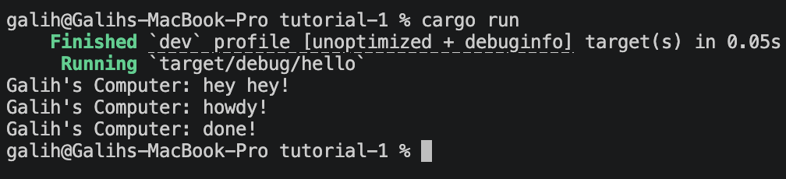

# Module 10: Asynchronous Programming - Galih Nur Rizqy (2406343224)

## Experiment 1.2: Understanding how it works.

Ditambahkan satu baris `println!("Galih's Computer: hey hey!")` tepat setelah blok `spawner.spawn(...)` ditutup. Hasil yang muncul di konsol adalah `hey hey!` lebih dulu, baru `howdy!`, lalu setelah 2 detik `done!` — padahal secara urutan kode, `howdy!` ada di dalam spawn yang ditulis lebih atas.

Hal ini terjadi karena `spawner.spawn()` tidak langsung menjalankan future. Spawn hanya memasukkan task ke dalam antrian channel, dan future tersebut baru benar-benar dieksekusi ketika `executor.run()` dipanggil di bawahnya. Sementara itu, baris `println!` setelah spawn adalah kode sinkronus biasa yang langsung dijalankan thread utama.

Ini menunjukkan sifat *lazy* dari async Rust — future tidak berjalan sendiri tanpa executor yang meng-poll-nya. Pemisahan antara "mendaftarkan task" (spawn) dan "menjalankan task" (executor.run) adalah inti dari bagaimana async runtime bekerja.

