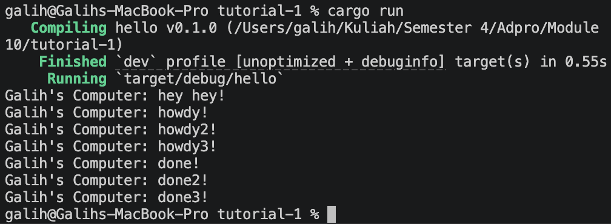
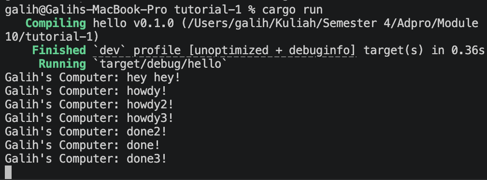
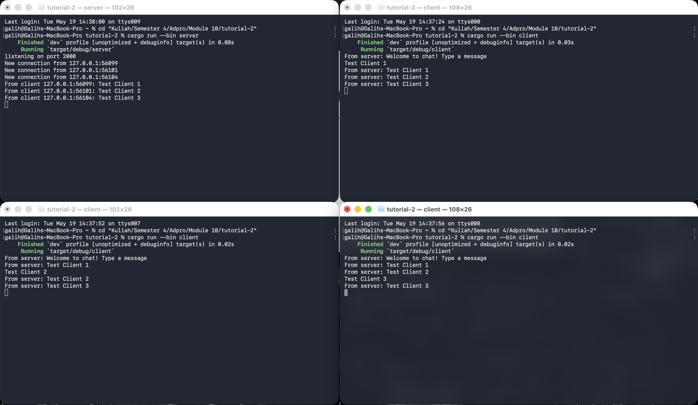
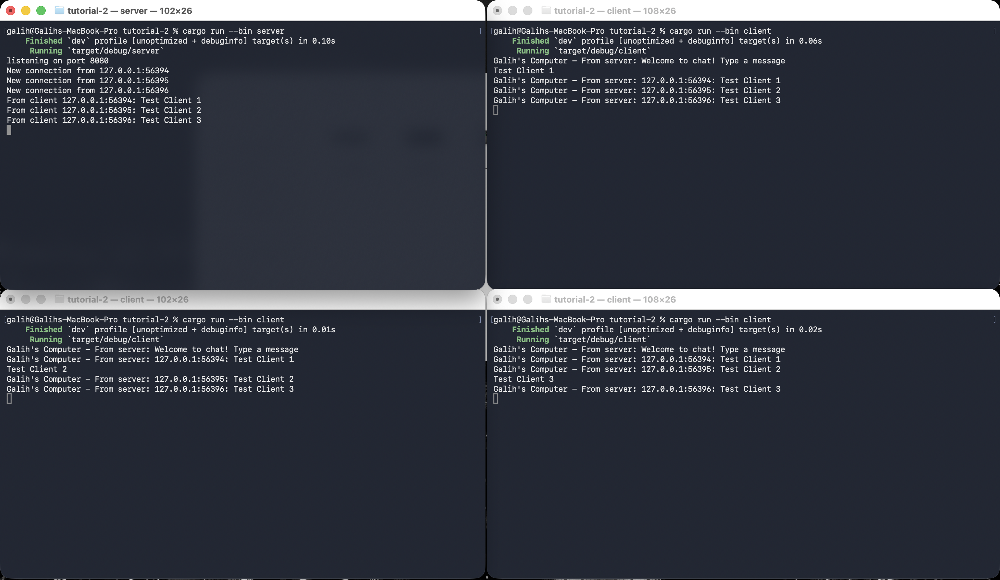
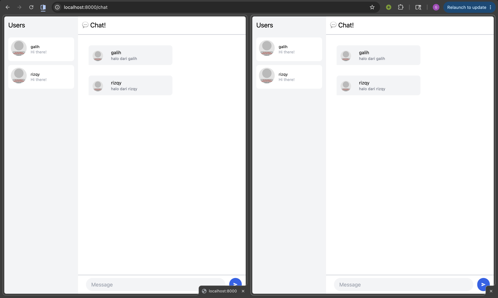
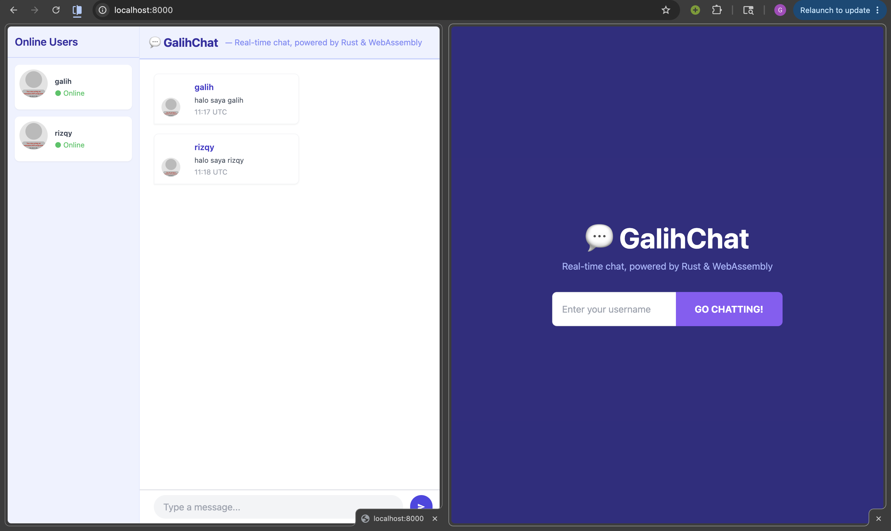
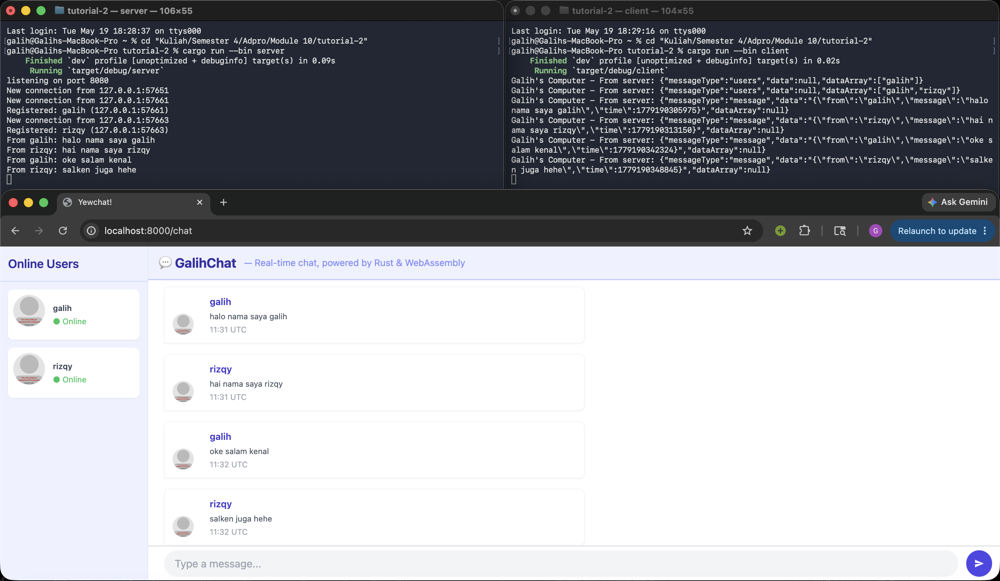

# Module 10: Asynchronous Programming - Galih Nur Rizqy (2406343224)

## Experiment 1.2: Understanding how it works.

Ditambahkan satu baris `println!("Galih's Computer: hey hey!")` tepat setelah blok `spawner.spawn(...)` ditutup. Hasil yang muncul di konsol adalah `hey hey!` lebih dulu, baru `howdy!`, lalu setelah 2 detik `done!`, padahal secara urutan kode, `howdy!` ada di dalam spawn yang ditulis lebih atas.

Hal ini terjadi karena `spawner.spawn()` tidak langsung menjalankan future. Spawn hanya memasukkan task ke dalam antrian channel, dan future tersebut baru benar-benar dieksekusi ketika `executor.run()` dipanggil di bawahnya. Sementara itu, baris `println!` setelah spawn adalah kode sinkronus biasa yang langsung dijalankan thread utama.

Ini menunjukkan sifat *lazy* dari async Rust, future tidak berjalan sendiri tanpa executor yang meng-poll-nya. Pemisahan antara "mendaftarkan task" (spawn) dan "menjalankan task" (executor.run) adalah inti dari bagaimana async runtime bekerja.

## Experiment 1.3: Multiple Spawn and removing drop

Pada eksperimen ini dilakukan dua hal: menambah jumlah spawn menjadi tiga, lalu mencoba menghapus `drop(spawner)`.

Dengan tiga spawn sekaligus, ketiga future dijadwalkan ke antrian sebelum `executor.run()` dipanggil. Saat executor mulai berjalan, ketiga task di-poll satu per satu secara bergantian. Setelah masing-masing mencapai `.await` pada `TimerFuture`, eksekusi task tersebut ditangguhkan dan executor beralih ke task berikutnya. Inilah yang membuat ketiga `howdy!` muncul hampir bersamaan di awal, lalu ketiga `done!` muncul setelah ~2 detik, urutannya tidak selalu 1-2-3 karena bergantung pada thread mana yang lebih dulu bangun dari sleep.

Ketika `drop(spawner)` dihapus, program tidak pernah keluar meskipun semua task sudah selesai. Penyebabnya adalah `executor.run()` berjalan dengan loop `while let Ok(task) = self.ready_queue.recv()`, loop ini baru berhenti kalau channel sudah ditutup. Channel baru ditutup ketika semua `Sender`-nya di-drop, dan satu-satunya Sender adalah `spawner`. Selama `spawner` masih hidup (belum didrop), `recv()` terus menunggu task baru yang tidak pernah datang, sehingga program hang selamanya.

Jadi peran masing-masing komponen: **spawner** mendaftarkan task ke antrian, **executor** mengeksekusi task-task tersebut, dan **drop(spawner)** adalah sinyal bahwa tidak ada lagi task yang akan masuk sehingga executor bisa berhenti dengan bersih.

## Experiment 2.1: Original code, and how it run

Kode broadcast chat ini diambil dari *Google Comprehensive Rust* dan dijalankan dengan satu server dan tiga client secara bersamaan. Cara menjalankannya: buka satu terminal untuk server dengan `cargo run --bin server`, lalu buka tiga terminal terpisah masing-masing untuk client dengan `cargo run --bin client`.

Ketika client terhubung, server langsung mengirim pesan sambutan "Welcome to chat! Type a message". Setelah itu, teks apapun yang diketik di salah satu client akan dikirim ke server sebagai WebSocket message, lalu server mem-broadcast pesan tersebut ke semua client yang sedang terhubung, termasuk pengirimnya sendiri.

Mekanisme ini bekerja dengan `tokio::broadcast::channel`: setiap client punya satu `Sender` (dikloning dari channel utama) dan satu `Receiver` (didapat dari `subscribe()`). Di dalam `handle_connection`, `tokio::select!` dipakai untuk secara bersamaan menunggu dua hal: pesan masuk dari client via WebSocket, dan pesan broadcast dari client lain via channel. Ini adalah pola konkurensi async yang efisien karena tidak membutuhkan thread terpisah per client.

WebSocket dipilih sebagai protokol transport karena sifatnya yang full-duplex, server dan client bisa saling mengirim kapan saja tanpa menunggu giliran, berbeda dengan HTTP biasa yang request-response. Ini sangat cocok untuk aplikasi chat real-time.

## Experiment 2.2: Modifying port

Port diubah dari 2000 ke 8080 dengan memodifikasi dua file sekaligus: `server.rs` dan `client.rs`. Di `server.rs`, baris `TcpListener::bind("127.0.0.1:2000")` diubah menjadi `"127.0.0.1:8080"`. Di `client.rs`, URI koneksi `ws://127.0.0.1:2000` diubah menjadi `ws://127.0.0.1:8080`.

Kedua sisi harus diubah karena koneksi WebSocket bersifat client-server, port yang didengarkan server harus sama persis dengan port yang dituju client. Kalau hanya salah satu yang diubah, client akan gagal terhubung dengan error "connection refused".

Protokol yang digunakan tetap sama yaitu `ws://` (WebSocket tanpa enkripsi). Protokol ini didefinisikan di sisi client pada URI yang diteruskan ke `ClientBuilder::from_uri()`, sedangkan di sisi server tidak perlu mendefinisikan protokol secara eksplisit karena `TcpListener` bekerja di layer TCP dan `ServerBuilder` dari tokio-websockets yang menangani handshake WebSocket di atasnya.

Setelah perubahan ini, aplikasi tetap berjalan normal, server mencetak "listening on port 8080" dan client berhasil terhubung, membuktikan bahwa port hanyalah angka identifier dan tidak mempengaruhi perilaku aplikasi.

## Experiment 2.3: Small changes, add IP and Port

Modifikasi dilakukan di dua tempat. Di `server.rs`, pesan yang di-broadcast diubah dari teks mentah menjadi `format!("{addr}: {text}")` sehingga setiap pesan yang diterima client sudah menyertakan IP dan port pengirimnya. Di `client.rs`, output ketika menerima pesan ditambahkan prefiks `"Galih's Computer - From server: "` agar jelas pesan tersebut datang dari server dan siapa yang menerimanya.

Sebelum modifikasi ini, kalau dua client mengirim pesan bersamaan, penerima tidak bisa tahu siapa yang mengirim karena pesan tampil sebagai teks polos tanpa identitas. Dengan menambahkan addr pengirim di server sebelum broadcast, informasi ini ikut dikirim ke semua penerima tanpa perlu modifikasi tambahan di sisi client.

Pendekatan ini masuk akal karena server-lah yang tahu `SocketAddr` dari setiap koneksi — client tidak punya informasi tersebut. Jadi server menjadi satu-satunya tempat yang tepat untuk menyisipkan informasi pengirim ke dalam pesan sebelum disebarkan.

Hasilnya di konsol client terlihat seperti `"Galih's Computer - From server: 127.0.0.1:56394: Test Client 1"`, di mana `127.0.0.1:56394` adalah identitas pengirim pesan tersebut.

## Experiment 3.1: Original code

Cara menjalankan: nyalakan server dulu dengan `npm start` di folder `tutorial-3/server`, lalu jalankan client dengan `npm start` di folder `tutorial-3`. Browser otomatis terbuka di `localhost:8000` menampilkan halaman login dengan input username dan tombol "GO CHATTING!".

Setelah masuk, muncul tampilan chat dengan daftar user aktif di panel kiri dan area percakapan di kanan. Setiap pesan yang dikirim langsung muncul di semua tab yang sedang terhubung karena server mem-broadcast ke semua client. Komunikasi menggunakan format JSON dengan tiga jenis pesan: `register` saat user masuk, `message` untuk pesan chat, dan `users` untuk update daftar user aktif. Ini berbeda dari Tutorial 2 yang hanya mengirim teks polos, sehingga UI bisa menampilkan nama pengirim dan avatar secara terpisah.

## Experiment 3.2: Be Creative!

Ada empat modifikasi yang dilakukan pada tampilan YewChat. Pertama, login page diubah dari background abu-abu gelap menjadi indigo gelap, dilengkapi judul besar "💬 GalihChat" dan tagline "Real-time chat, powered by Rust & WebAssembly" agar identitas aplikasi lebih kuat. Kedua, header chat page juga menggunakan branding yang sama dengan tagline, sehingga konsisten di seluruh halaman.

Ketiga, teks "Hi there!" di daftar user diganti menjadi "● Online" berwarna hijau untuk memberi informasi status yang lebih bermakna — user yang muncul di list memang sedang aktif, jadi lebih jujur daripada placeholder generik. Keempat, setiap chat bubble kini menampilkan timestamp dalam format `HH:MM UTC` di bawah isi pesan, dihitung dari field `time` yang sudah dikirim server namun sebelumnya tidak ditampilkan di UI.

Perubahan ini tidak mengubah logika komunikasi sama sekali — hanya menyentuh layer presentasi di `chat.rs` dan `login.rs`. Ini menunjukkan salah satu keunggulan arsitektur komponen Yew: UI bisa dimodifikasi bebas tanpa menyentuh lapisan service atau state management.

## Bonus: Rust Websocket server for YewChat!

Server Tutorial 2 yang semula hanya membroadcast teks mentah dimodifikasi agar bisa melayani YewChat. Perubahan utamanya ada tiga: menambahkan `serde` dan `serde_json` ke dependensi, menambahkan struct `IncomingMessage` dan `OutgoingMessage` untuk parsing/serialisasi JSON, dan menambahkan `Arc<Mutex<HashMap<SocketAddr, String>>>` untuk menyimpan mapping antara alamat koneksi dan username masing-masing client.

Ketika client YewChat mengirim pesan `register`, server menyimpan username-nya ke dalam map lalu mem-broadcast daftar user aktif ke semua client dalam format `{"messageType":"users","dataArray":["user1","user2"]}`. Ketika pesan `message` diterima, server mencari username pengirim dari map, menyisipkan timestamp dari `SystemTime::now()`, lalu mem-broadcast dalam format yang diharapkan YewChat. Ketika koneksi terputus, entry dihapus dari map dan daftar user di-broadcast ulang.

Perubahan ini berhasil karena YewChat hanya peduli pada format pesan JSON dan port WebSocket (`ws://127.0.0.1:8080`), ia tidak peduli apakah server di belakangnya ditulis dalam JavaScript atau Rust. Selama format JSON-nya cocok, koneksi berjalan normal.

Dari sisi preferensi pribadi, versi Rust lebih menarik karena type system-nya memaksa semua struktur pesan didefinisikan secara eksplisit melalui `#[derive(Serialize, Deserialize)]`. Kesalahan format pesan akan tertangkap saat compile time, bukan saat runtime. Versi JavaScript lebih cepat untuk prototipe karena tidak perlu mendefinisikan tipe, tapi itu justru membuatnya lebih rentan terhadap bug yang hanya muncul saat production.

